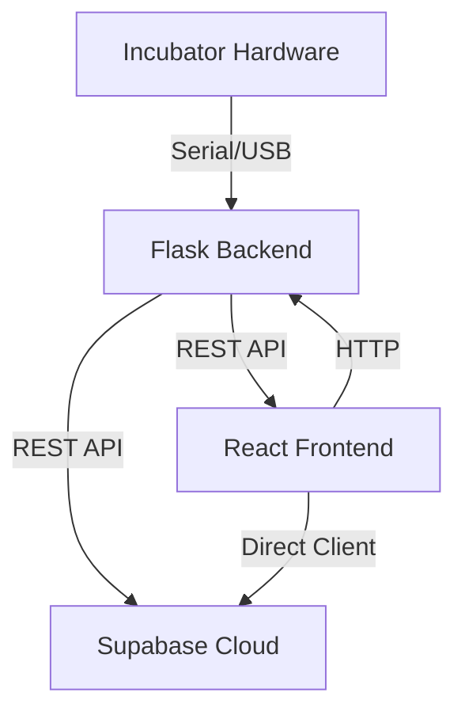

# Egg Incubator Control System

A full-stack application for monitoring and controlling an egg incubator, featuring a modern React frontend and a Python Flask backend. The system supports real-time sensor monitoring, actuator control, configuration management, and data logging, with cloud integration via Supabase.

---

## Table of Contents

- [Features](#features)
- [Architecture](#architecture)
- [Frontend](#frontend)
- [Backend](#backend)
- [Database](#database)
- [Setup & Installation](#setup--installation)
- [Usage](#usage)
- [Project Structure](#project-structure)


---

## Features

- **Live Dashboard:** Real-time temperature, humidity, and system status monitoring.
- **Automatic & Manual Modes:** Switch between fully automated control and manual actuator overrides.
- **Egg Type Presets:** Select and apply optimal settings for chicken, quail, duck, or turkey eggs.
- **Configuration Management:** Fine-tune temperature, humidity, rotation, and ventilation parameters.
- **Logs & History:** View and export system logs and historical data.
- **Settings:** Manage serial connection, security, backup, and application preferences.
- **Cloud Sync:** Sensor data is stored and retrieved from Supabase for persistence and analytics.

---

## Architecture



---

## Frontend

- **Tech Stack:** React, TypeScript, Tailwind CSS, React Router, TanStack Query, Supabase JS.
- **Location:** `src/`
- **Key Pages:**
  - **Dashboard:** Live sensor data, actuator status, and trends.
  - **Configuration:** Set thresholds and timings for all incubator systems.
  - **Manual Control:** Directly operate actuators (fan, heater, water valve, rotation).
  - **Automatic Mode:** Enable/disable and configure automatic control systems.
  - **Egg Type Selection:** Presets for different egg types.
  - **Logs & History:** Filterable, exportable logs.
  - **Settings:** Serial port, security, backup, and preferences.

---

## Backend

- **Tech Stack:** Python, Flask, Flask-CORS, PySerial, Supabase Python Client.
- **Location:** `server/`
- **Key Components:**
  - **Serial Reader:** Reads sensor data from the incubator via serial port. Falls back to simulation if hardware is unavailable.
  - **API Endpoint:** `/api/data` returns the latest sensor readings as JSON.
  - **Supabase Integration:** Periodically saves sensor data to Supabase.
  - **Configuration:** All dependencies listed in `server/requirements.txt`.

---

## Database

- **Supabase:** Used for storing sensor data and enabling cloud-based analytics and persistence.
- **Tables:** At minimum, a `sensor_data` table with fields for temperature and humidity.

---

## Setup & Installation

### Prerequisites

- Node.js (for frontend)
- Python 3.10+ (for backend)
- [Supabase account](https://supabase.com/) (for cloud storage)
- (Optional) Physical incubator hardware with serial output

### Backend

1. **Install dependencies:**
   ```bash
   cd server
   python -m venv venv
   venv\Scripts\activate  # On Windows
   pip install -r requirements.txt
   ```

2. **Configure Supabase:**
   - Set your Supabase URL and API key in `server/utils/serial_reader.py`.

3. **Run the backend:**
   ```bash
   python app.py
   ```

### Frontend

1. **Install dependencies:**
   ```bash
   cd ..
   npm install
   ```

2. **Configure Supabase:**
   - Set your Supabase URL and API key in `src/integration/supabase/supabase.js`.

3. **Run the frontend:**
   ```bash
   npm run dev
   ```

---

## Usage

- Access the frontend at [http://localhost:3000](http://localhost:3000).
- The backend API runs by default on [http://localhost:5000](http://localhost:5000).
- Use the dashboard for live monitoring, and navigate through the sidebar for configuration, control, and logs.

---

## Project Structure

```
website/
  ├── server/                # Python Flask backend
  │   ├── app.py
  │   ├── requirements.txt
  │   ├── routes/
  │   │   └── api.py
  │   └── utils/
  │       └── serial_reader.py
  ├── src/                   # React frontend
  │   ├── App.tsx
  │   ├── index.css
  │   ├── components/
  │   ├── pages/
  │   └── integration/
  │       └── supabase/
  │           └── supabase.js
  └── ...
```

---

## License

This project is licensed under the MIT License. 
